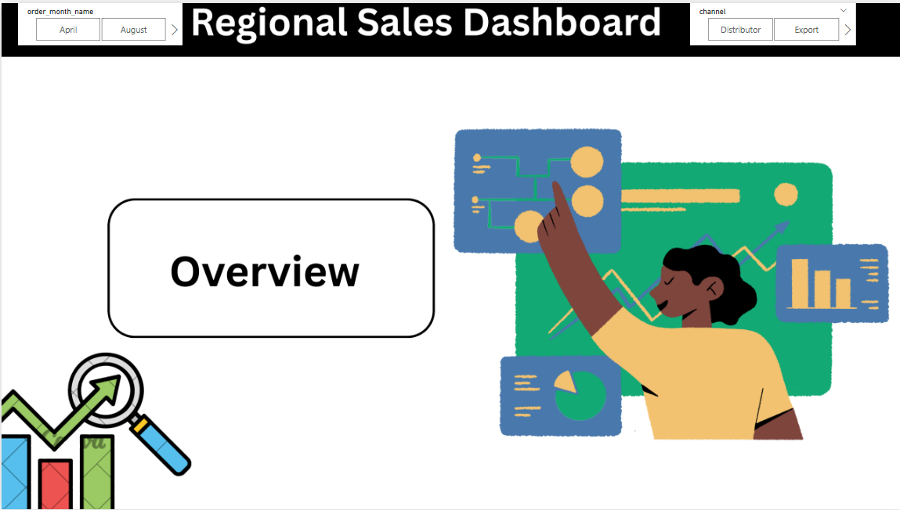
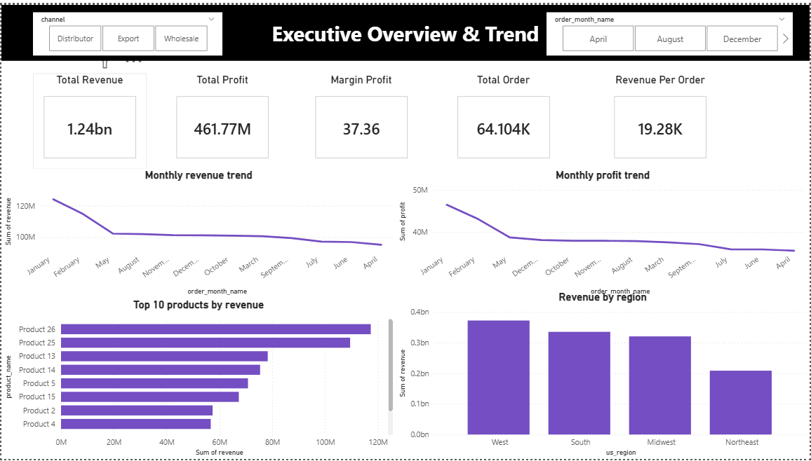

# Sales Analysis: End-to-End Data Pipeline

An end-to-end data analytics workflow focused on transforming raw sales data into a validated database structure and interactive business intelligence reports. The pipeline utilizes **Excel** for data exploration, **Python (Pandas)** for data cleaning, **SQL** for staging, and **Power BI** for final reporting.

---

## 📊 Project Visuals

### Home View

### Performance Overview

---

## 🛠️ Project Workflow

1. **Data Discovery (Excel):** Evaluated the initial uncleaned dataset (`sales_raw_500.xlsx`) containing 520 rows to analyze data types, locate null values, and find formatting errors.
2. **Data Cleaning & Engineering (Python):** Developed automated data cleaning steps using a Jupyter Notebook (`Sales Analysis.ipynb`). This stage filtered out invalid rows, handled missing values, and exported a reliable baseline dataset (`sales_cleaned.csv`), bringing the final count to **482 clean records**.
3. **Database Integration (SQL):** Structured and loaded the processed CSV into a SQL environment to simulate enterprise relational storage.
4. **Data Modeling & Visualization (Power BI):** Maintained data models and wrote custom DAX formulas within Power BI (`sales.pbix`) to create interactive matrix charts, cards, and bar charts.

---

## 📉 Data Quality & Transformation Metrics

* **Raw Rows Ingested:** 520 rows
* **Cleaned Rows Retained:** 482 rows
* **Data Fields Standardized:** Product Segment, Regions, Order Dates, Total Sales, and Total Profit.

---

## 🚀 Real Business Insights

Based on the 482 verified transaction records, the final dashboard highlights the following specific findings:

* **Regional Allocation:** Sales distributions are clearly segmented across four key regions—**East, West, North, and South**. The data enables immediate mapping of exactly which regional hubs drive volume versus those underperforming.
* **Profitability Realities:** Using the custom **`% of Profit on Sales`** DAX calculation, the metrics split pure revenue away from net profit. This isolates product lines that generate high top-line sales but yield weak profit margins due to operational or delivery costs.
* **Product Performance Tracker:** Segmented visualizations isolate high-velocity products from stagnant stock, offering a concrete data foundation to adjust inventory and marketing focus.

---

## 📂 File Structure

* `sales_raw_500.xlsx` - Source dataset with original unformatted entries.
* `Sales Analysis.ipynb` - Python notebook containing the Pandas cleaning scripts.
* `sales_cleaned.csv` - The cleaned, deduplicated output file.
* `sales.pbix` - Power BI workbook with the active data model and DAX measures.
* `home.png` - Image file displaying the primary dashboard home interface.
* `overview.png` - Image file showing the detailed analytical performance overview.

---

## 🔧 Setup and Execution

1. **Clean Raw Data:** Open and run `Sales Analysis.ipynb` to regenerate the `sales_cleaned.csv`.
2. **Database Load:** Upload the generated `sales_cleaned.csv` file into your local SQL database engine.
3. **Review Insights:** Open `sales.pbix` in Power BI Desktop to check the DAX metrics, underlying data model connections, and visual layouts.
